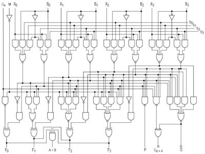

# Bits bytes og gates

## Bits

Bits er en metoden cpuen bruker for å forstå. En bit er representert som enten en 1 eller en 0. Måten cpuen kan gjenkjenne det på er basert på hvor mange volts hver bit har. Hvis en bit måler 0 volt så har bit'en verdi 0 og hvis den har 5 eller 3.3 volt så har bit'en verdi 1. Disse verdiene kalles også lavt og høyt henholdsvis.

## Bytes

Til forskjell fra en enkelt bit, som enten er en 1 eller en 0, er en byte en større enhet som består av 8 biter. Dette gir betydelig mer variasjon i representasjonen av data.

Hver byte kan inneholde en unik kombinasjon av 8 biter, og dette gir oss 256 forskjellige mulige verdier for hver byte. Bytes brukes til å representere alt fra bokstaver og tall til mer komplekse data som farger, lyder og instruksjoner for datamaskinen.

Hver bit kan ha to mulige verdier: 0 eller 1. Når du har 8 biter, kan du tenke på det som å ha 2 valgmuligheter for hver av de 8 posisjonene. Så for den første biten kan du velge 0 eller 1, for den andre biten kan du også velge 0 eller 1, og så videre for alle de 8 bitene.

## Gates

Gates tar en eller flere binære(bits) innganger (0 eller 1) og utfører en bestemt logisk operasjon på disse inngangene for å produsere en utgang. De mest grunnleggende logiske porter inkluderer:

|   p       |   q | p AND q
|:-------------------------:|:---------------------:|:---------------------:
|   0                       |   0|0
|   0                       |   1|0
|   1                       |   0|0
|   1                       |   1|1

|   p       |   q | p OR q
|:-------------------------:|:---------------------:|:---------------------:
|   0                       |   0|0
|   0                       |   1|1
|   1                       |   0|1
|   1                       |   1|1

|   p       |   q | p XOR q
|:-------------------------:|:---------------------:|:---------------------:
|   0                       |   0|0
|   0                       |   1|1
|   1                       |   0|1
|   1                       |   1|0

|   p       | NOT p
|:-------------------------:|:---------------------:
|   0                       |   1
|   1           |   0

Det er også gates som NAND og NOR som er det samme som å ta svaret fra den gaten og kjøre gjennom en not gate.

<b> Hva brukes gates til:</b>

Gates er byggeklossene for logiske kretser, og de brukes til å utføre komplekse logiske operasjoner som styrer funksjonaliteten til datamaskiner og digitale enheter. De er grunnlaget for alt fra mikroprosessorer og minneenheter til kommunikasjonssystemer og kontrollsystemer. Her er noen eksempler på bruken av gates:

1. ALU er bygget opp av gates

> Denne ALUen er består opp av (NOT, AND , NOR, NAND og XOR)

<i>Viktig å huske at dette er intro så greit å ikke skjønne med en gang, viktigste er at dere skjønner at det er dette som utgjør hvordan de fleste delene av en cpu er bygget opp
